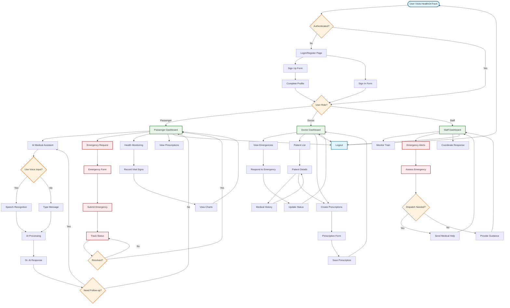
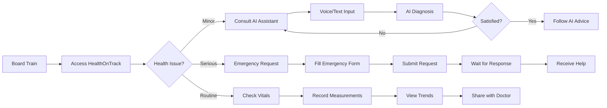
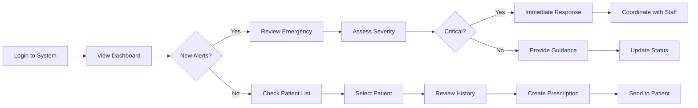
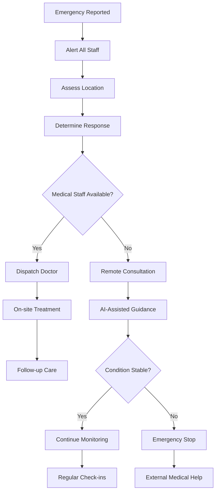

# HealthOnTrack 🚂💊

A comprehensive railway medical assistance platform providing AI-powered health guidance, emergency services, and medical management for train passengers and staff.

## 🚀 Features

- **🤖 AI Medical Assistant**: Speech-to-text enabled Dr. AI for health consultations
- **🚨 Emergency Services**: Real-time emergency request and response system
- **📊 Health Monitoring**: Vital signs tracking and prescription management
- **👥 Multi-Role Dashboard**: Separate interfaces for passengers, doctors, and staff
- **🎤 Voice Input**: Advanced speech recognition for accessibility
- **📱 Responsive Design**: Works seamlessly on all devices

## 🛠️ Tech Stack

### Frontend
- **Framework**: [Next.js 16.0.0](https://nextjs.org/) (React 19.2.0)
- **Language**: TypeScript 5.x
- **Styling**: [Tailwind CSS 4.1.9](https://tailwindcss.com/)
- **UI Components**: [Radix UI](https://www.radix-ui.com/) + Custom Components
- **Icons**: [Lucide React](https://lucide.dev/)
- **Animations**: [Framer Motion 12.23.24](https://www.framer.com/motion/)
- **Charts**: [Recharts 2.15.4](https://recharts.org/)

### Backend & Database
- **Runtime**: Node.js with Next.js API Routes
- **Database**: [SQLite](https://www.sqlite.org/) with [Better-SQLite3](https://github.com/WiseLibs/better-sqlite3)
- **ORM**: Custom SQL queries with type safety
- **Authentication**: Custom JWT-based auth system

### AI & Speech
- **AI Provider**: [Google Gemini API](https://ai.google.dev/) (gemini-2.0-flash)
- **Speech Recognition**: Web Speech API (Browser Native)
- **Voice Input**: Custom React hooks with TypeScript support

### Development Tools
- **Package Manager**: npm/pnpm
- **Linting**: ESLint with Next.js config
- **Type Checking**: TypeScript with strict mode
- **Build Tool**: Next.js with Turbopack
- **Version Control**: Git
- **Documentation**: Mermaid flowcharts for workflow visualization

### Deployment & Performance
- **Platform**: Vercel-ready (Next.js native)
- **Analytics**: Vercel Analytics integration
- **Performance**: Built-in Next.js optimizations
- **Caching**: Next.js automatic caching strategies

## 📁 Project Structure

```
HealthOnTrack/
├── 📁 app/                    # Next.js App Router
│   ├── 📁 api/               # API Routes
│   │   ├── auth/             # Authentication endpoints
│   │   ├── emergency/        # Emergency management
│   │   ├── gemini/           # AI chat integration
│   │   ├── messages/         # Message handling
│   │   ├── prescriptions/    # Prescription management
│   │   └── vitals/           # Health monitoring
│   ├── 📁 dashboard/         # Role-based dashboards
│   │   └── passenger/        # Passenger portal
│   ├── 📁 login/            # Authentication pages
│   ├── 📁 signup/           # Registration pages
│   ├── layout.tsx           # Root layout
│   └── page.tsx             # Landing page
├── 📁 components/            # Reusable UI components
│   ├── 📁 ui/               # Base UI components (Radix)
│   ├── dashboard-layout.tsx  # Dashboard wrapper
│   └── navigation.tsx       # Navigation components
├── 📁 lib/                  # Utility libraries
│   ├── auth-context.tsx     # Authentication context
│   ├── database.ts          # Database connection
│   └── utils.ts             # Helper functions
├── 📁 hooks/                # Custom React hooks
│   ├── use-speech-recognition.ts  # Speech-to-text hook
│   └── use-toast.ts         # Toast notifications
├── 📁 types/                # TypeScript definitions
│   └── speech.d.ts          # Web Speech API types
├── 📁 data/                 # Database files
│   └── healthontrack.db     # SQLite database
├── 📁 public/               # Static assets
├── 📁 styles/               # Global styles
└── 📄 Configuration files   # Next.js, TypeScript, etc.
```

## 🔄 Workflow & Architecture

### **Platform Workflow Diagram**



### **Detailed User Journey Flows**

#### **🚂 Passenger Journey**


#### **👨‍⚕️ Doctor Workflow**


#### **🚨 Emergency Response Flow**


### 1. **User Authentication Flow**
```javascript
// Vanilla JS equivalent of auth flow
class AuthenticationFlow {
  constructor() {
    this.currentUser = null;
    this.token = localStorage.getItem('auth-token');
  }

  async login(email, password) {
    try {
      const response = await fetch('/api/auth/login', {
        method: 'POST',
        headers: { 'Content-Type': 'application/json' },
        body: JSON.stringify({ email, password })
      });
      
      const data = await response.json();
      if (data.success) {
        this.token = data.token;
        this.currentUser = data.user;
        localStorage.setItem('auth-token', this.token);
        this.redirectToDashboard(data.user.role);
      }
    } catch (error) {
      console.error('Login failed:', error);
    }
  }

  redirectToDashboard(role) {
    const dashboards = {
      'passenger': '/dashboard/passenger',
      'doctor': '/dashboard/doctor',
      'staff': '/dashboard/staff'
    };
    window.location.href = dashboards[role] || '/dashboard/passenger';
  }
}
```

### 2. **AI Chat Integration Workflow**
```javascript
// Vanilla JS equivalent of AI chat system
class AIChat {
  constructor() {
    this.conversationHistory = [];
    this.isTyping = false;
  }

  async sendMessage(message) {
    // Add user message to history
    this.addMessage('user', message);
    this.isTyping = true;

    try {
      const response = await fetch('/api/gemini', {
        method: 'POST',
        headers: { 'Content-Type': 'application/json' },
        body: JSON.stringify({
          prompt: message,
          conversationHistory: this.conversationHistory.slice(-6)
        })
      });

      const data = await response.json();
      this.addMessage('ai', data.reply);
    } catch (error) {
      this.addMessage('system', 'Error: Could not reach AI assistant');
    } finally {
      this.isTyping = false;
    }
  }

  addMessage(sender, content) {
    const message = {
      id: Date.now(),
      sender: sender,
      message: content,
      time: new Date().toLocaleTimeString()
    };
    this.conversationHistory.push(message);
    this.renderMessage(message);
  }

  renderMessage(message) {
    const chatContainer = document.getElementById('chat-messages');
    const messageElement = document.createElement('div');
    messageElement.className = `message ${message.sender}`;
    messageElement.innerHTML = `
      <div class="message-content">
        <strong>${message.sender}:</strong>
        <p>${message.message}</p>
        <span class="timestamp">${message.time}</span>
      </div>
    `;
    chatContainer.appendChild(messageElement);
    chatContainer.scrollTop = chatContainer.scrollHeight;
  }
}
```

### 3. **Speech Recognition Workflow**
```javascript
// Vanilla JS speech recognition implementation
class SpeechRecognition {
  constructor() {
    this.recognition = null;
    this.isListening = false;
    this.isSupported = false;
    this.initializeSpeechRecognition();
  }

  initializeSpeechRecognition() {
    // Check browser support
    const SpeechRecognition = window.SpeechRecognition || window.webkitSpeechRecognition;
    
    if (SpeechRecognition) {
      this.isSupported = true;
      this.recognition = new SpeechRecognition();
      
      // Configure recognition
      this.recognition.continuous = true;
      this.recognition.interimResults = true;
      this.recognition.lang = 'en-US';

      // Event handlers
      this.recognition.onstart = () => {
        this.isListening = true;
        this.updateUI('listening');
      };

      this.recognition.onresult = (event) => {
        let finalTranscript = '';
        
        for (let i = event.resultIndex; i < event.results.length; i++) {
          const transcript = event.results[i][0].transcript;
          if (event.results[i].isFinal) {
            finalTranscript += transcript;
          }
        }

        if (finalTranscript) {
          this.onTranscriptReceived(finalTranscript);
        }
      };

      this.recognition.onerror = (event) => {
        this.handleSpeechError(event.error);
      };

      this.recognition.onend = () => {
        this.isListening = false;
        this.updateUI('stopped');
      };
    }
  }

  startListening() {
    if (this.isSupported && !this.isListening) {
      try {
        this.recognition.start();
      } catch (error) {
        console.error('Could not start speech recognition:', error);
      }
    }
  }

  stopListening() {
    if (this.recognition && this.isListening) {
      this.recognition.stop();
    }
  }

  handleSpeechError(error) {
    switch (error) {
      case 'no-speech':
        // Normal - continue listening
        break;
      case 'not-allowed':
        alert('Microphone access denied. Please allow microphone access.');
        break;
      case 'network':
        alert('Network error. Please check your connection.');
        break;
      default:
        console.error('Speech recognition error:', error);
    }
  }

  onTranscriptReceived(transcript) {
    // Update input field with transcribed text
    const inputField = document.getElementById('message-input');
    if (inputField) {
      inputField.value += transcript;
    }
  }

  updateUI(state) {
    const micButton = document.getElementById('mic-button');
    const statusIndicator = document.getElementById('status-indicator');
    
    switch (state) {
      case 'listening':
        micButton.classList.add('recording');
        statusIndicator.textContent = 'Listening...';
        break;
      case 'stopped':
        micButton.classList.remove('recording');
        statusIndicator.textContent = 'Click to speak';
        break;
    }
  }
}
```

### 4. **Emergency Request Workflow**
```javascript
// Vanilla JS emergency system
class EmergencySystem {
  constructor() {
    this.emergencyTypes = [
      'Medical Emergency',
      'Accident',
      'Security Issue',
      'Fire Emergency',
      'Other'
    ];
  }

  async submitEmergency(emergencyData) {
    const emergency = {
      id: this.generateEmergencyId(),
      type: emergencyData.type,
      description: emergencyData.description,
      location: emergencyData.location,
      severity: emergencyData.severity,
      timestamp: new Date().toISOString(),
      status: 'pending',
      userId: this.getCurrentUserId()
    };

    try {
      const response = await fetch('/api/emergency', {
        method: 'POST',
        headers: { 
          'Content-Type': 'application/json',
          'Authorization': `Bearer ${this.getAuthToken()}`
        },
        body: JSON.stringify(emergency)
      });

      const result = await response.json();
      if (result.success) {
        this.showEmergencyConfirmation(result.emergencyId);
        this.startEmergencyTracking(result.emergencyId);
      }
    } catch (error) {
      console.error('Emergency submission failed:', error);
      this.showEmergencyError();
    }
  }

  generateEmergencyId() {
    return 'EMG-' + Date.now() + '-' + Math.random().toString(36).substr(2, 9);
  }

  startEmergencyTracking(emergencyId) {
    // Poll for emergency status updates
    const pollInterval = setInterval(async () => {
      try {
        const response = await fetch(`/api/emergency/${emergencyId}`);
        const data = await response.json();
        
        if (data.status === 'resolved' || data.status === 'cancelled') {
          clearInterval(pollInterval);
        }
        
        this.updateEmergencyStatus(data);
      } catch (error) {
        console.error('Error tracking emergency:', error);
      }
    }, 5000); // Poll every 5 seconds
  }

  updateEmergencyStatus(emergencyData) {
    const statusElement = document.getElementById('emergency-status');
    if (statusElement) {
      statusElement.innerHTML = `
        <div class="emergency-update">
          <h3>Emergency Status: ${emergencyData.status.toUpperCase()}</h3>
          <p>Last Updated: ${new Date(emergencyData.updatedAt).toLocaleString()}</p>
          ${emergencyData.response ? `<p>Response: ${emergencyData.response}</p>` : ''}
        </div>
      `;
    }
  }
}
```

### 5. **Database Operations Workflow**
```javascript
// Vanilla JS equivalent of database operations
class DatabaseOperations {
  constructor() {
    this.baseURL = '/api';
  }

  async createUser(userData) {
    return await this.makeRequest('POST', '/auth/signup', userData);
  }

  async getVitals(userId) {
    return await this.makeRequest('GET', `/vitals?userId=${userId}`);
  }

  async savePrescription(prescriptionData) {
    return await this.makeRequest('POST', '/prescriptions', prescriptionData);
  }

  async makeRequest(method, endpoint, data = null) {
    const config = {
      method: method,
      headers: {
        'Content-Type': 'application/json',
        'Authorization': `Bearer ${this.getAuthToken()}`
      }
    };

    if (data && (method === 'POST' || method === 'PUT')) {
      config.body = JSON.stringify(data);
    }

    try {
      const response = await fetch(this.baseURL + endpoint, config);
      return await response.json();
    } catch (error) {
      console.error('Database operation failed:', error);
      throw error;
    }
  }

  getAuthToken() {
    return localStorage.getItem('auth-token');
  }
}
```

## 🚀 Getting Started

### Prerequisites
- Node.js 18+ 
- npm or pnpm
- Git

### Installation

1. **Clone the repository**
   ```bash
   git clone <repository-url>
   cd HealthOnTrack
   ```

2. **Install dependencies**
   ```bash
   npm install
   # or
   pnpm install
   ```

3. **Set up environment variables**
   ```bash
   cp .env.example .env.local
   ```
   
   Add your environment variables:
   ```env
   GEMINI_API_KEY=your_gemini_api_key_here
   JWT_SECRET=your_jwt_secret_here
   DATABASE_URL=./data/healthontrack.db
   ```

4. **Initialize the database**
   ```bash
   npm run db:setup
   ```

5. **Start the development server**
   ```bash
   npm run dev
   ```

6. **Open your browser**
   Navigate to [http://localhost:3000](http://localhost:3000)

### Build for Production

```bash
npm run build
npm start
```

## 📚 API Documentation

### Authentication Endpoints
- `POST /api/auth/login` - User login
- `POST /api/auth/signup` - User registration
- `GET /api/auth/me` - Get current user

### AI Chat Endpoints
- `POST /api/gemini` - Send message to AI assistant

### Emergency Endpoints
- `POST /api/emergency` - Submit emergency request
- `GET /api/emergency/[id]` - Get emergency status
- `PUT /api/emergency/[id]` - Update emergency status

### Health Endpoints
- `GET /api/vitals` - Get vital signs
- `POST /api/vitals` - Record vital signs
- `GET /api/prescriptions` - Get prescriptions
- `POST /api/prescriptions` - Add prescription

## 🎯 Key Features Implementation

### 1. **AI Medical Assistant**
- Real-time chat with Google Gemini AI
- Medical-specific system prompts
- Conversation history management
- Emergency situation detection

### 2. **Speech-to-Text Integration**
- Web Speech API implementation
- Real-time transcription
- Error handling and recovery
- Cross-browser compatibility

### 3. **Emergency Management**
- Real-time emergency requests
- Status tracking and updates
- Multi-role response system
- Location-based routing

### 4. **Health Monitoring**
- Vital signs tracking
- Prescription management
- Medical history storage
- Data visualization with charts

## 🔧 Development Scripts

```bash
npm run dev          # Start development server
npm run build        # Build for production
npm run start        # Start production server
npm run lint         # Run ESLint
npm run type-check   # Run TypeScript checks
npm run db:setup     # Initialize database
npm run db:reset     # Reset database
```

## 🤝 Contributing

1. Fork the repository
2. Create a feature branch (`git checkout -b feature/amazing-feature`)
3. Commit your changes (`git commit -m 'Add amazing feature'`)
4. Push to the branch (`git push origin feature/amazing-feature`)
5. Open a Pull Request

## 📄 License

This project is licensed under the MIT License - see the [LICENSE](LICENSE) file for details.

## 📊 Workflow Diagrams

The flowcharts in this README are created using **Mermaid**, a markdown-based diagramming tool that renders beautiful flowcharts directly in GitHub and most modern documentation platforms.

### **Viewing Flowcharts**
- **GitHub**: Flowcharts render automatically in the README
- **VS Code**: Install the "Mermaid Preview" extension
- **Online**: Use [Mermaid Live Editor](https://mermaid.live/) to view/edit

### **Editing Flowcharts**
To modify the workflow diagrams:

1. **Online Editor**: Copy the mermaid code to [mermaid.live](https://mermaid.live/)
2. **Local Development**: Use VS Code with Mermaid extensions
3. **Documentation**: Update the README.md file directly

### **Flowchart Types Used**
- **Main Workflow**: Complete platform user journey
- **Role-Specific Flows**: Passenger, Doctor, Staff workflows  
- **Feature Flows**: Emergency response, AI chat, health monitoring

## 🆘 Support

For support and questions:
- Create an issue in the GitHub repository
- Contact the development team
- Check the documentation in the `/docs` folder
- View workflow diagrams for understanding user journeys

---

**Built with ❤️ for railway medical assistance**